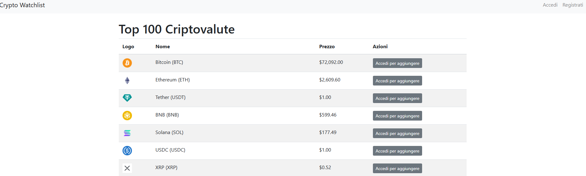

# Crypto Tracker Web App

 

Una web app che mostra la **top 100 delle criptovalute**, permette agli utenti di **registrarsi**, effettuare il **login** e salvare le proprie **watchlist**, con una **grafica moderna** e supporto per la **modalità notte**.

## Indice

- [Demo](#demo)
- [Funzionalità](#funzionalità)
- [Tecnologie Utilizzate](#tecnologie-utilizzate)
- [Prerequisiti](#prerequisiti)
- [Installazione](#installazione)
- [Configurazione](#configurazione)
- [Esecuzione dell'Applicazione](#esecuzione-dellapplicazione)
- [Struttura del Progetto](#struttura-del-progetto)
- [Screenshot](#screenshot)
- [Possibili Miglioramenti](#possibili-miglioramenti)
- [Contributi](#contributi)
- [Licenza](#licenza)
- [Ringraziamenti](#ringraziamenti)

---

## Funzionalità

- Visualizza la **top 100** delle criptovalute con dati aggiornati.
- **Registrazione** e **login** per gli utenti.
- **Salvataggio** di criptovalute preferite in una **watchlist** personalizzata.
- **Modalità notte** per un'esperienza utente ottimale.
- Interfaccia utente **responsiva** e **moderna** grazie a Bootstrap.
- **Sicurezza** dei dati degli utenti con password hash e sessioni protette.

## Tecnologie Utilizzate

### Backend

- **Python 3**: Linguaggio di programmazione.
- **Flask**: Micro-framework per lo sviluppo web.
- **Flask-Login**: Gestione dell'autenticazione dell'utente.
- **Flask-WTF**: Gestione dei form con protezione CSRF.
- **SQLite**: Database leggero per memorizzare utenti e watchlist.
- **Requests**: Per effettuare richieste HTTP all'API di CoinGecko.

### Frontend

- **HTML5** e **CSS3**
- **JavaScript**
- **Bootstrap 4**: Framework CSS per una grafica moderna e responsiva.
- **Jinja2**: Template engine utilizzato da Flask per generare HTML dinamico.

### API

- **CoinGecko API**: Per ottenere dati aggiornati sulle criptovalute.

## Prerequisiti

- **Python 3.x** installato sul sistema.
- **Pip** per la gestione dei pacchetti Python.
- **Virtualenv** (opzionale ma consigliato) per isolare l'ambiente Python.

## Installazione

1. **Clona il repository**

   ```bash
   git clone https://github.com/tuo_username/crypto-watchlist.git
   cd crypto-watchlist
   ```

2. **Crea un ambiente virtuale**

   ```bash
   python3 -m venv venv
   source venv/bin/activate  # Su Windows: venv\Scripts\activate
   ```

3. **Installa le dipendenze**

   ```bash
   pip install -r requirements.txt
   ```

## Configurazione

1. **Imposta la chiave segreta**

   Nel file `app.py`, sostituisci `'your_secret_key'` con una chiave segreta sicura.

   ```python
   app.config['SECRET_KEY'] = 'la_tua_chiave_segreta'
   ```

2. **Database**

   Il database SQLite verrà creato automaticamente nella cartella `instance/` la prima volta che esegui l'applicazione.

## Esecuzione dell'Applicazione

1. **Esegui l'applicazione**

   ```bash
   python app.py
   ```

2. **Accedi all'applicazione**

   Apri il browser e visita `http://localhost:5000` per utilizzare l'app.

## Struttura del Progetto

```
crypto-watchlist/
├── app.py
├── models.py
├── forms.py
├── requirements.txt
├── templates/
│   ├── base.html
│   ├── index.html
│   ├── login.html
│   ├── register.html
│   ├── watchlist.html
├── static/
│   ├── style.css
│   └── script.js
└── instance/
    └── app.db
```

- **app.py**: File principale dell'applicazione Flask.
- **models.py**: Definizione dei modelli del database (User e Watchlist).
- **forms.py**: Definizione dei form per registrazione e login.
- **templates/**: Cartella che contiene i template HTML.
- **static/**: Cartella per file CSS, JavaScript e immagini.
- **instance/**: Cartella che contiene il database SQLite.

## Screenshot

### Pagina Principale

 <!-- Sostituisci con gli URL reali delle immagini -->

### Registrazione


### Login


### Watchlist


### Modalità Notte


## Possibili Miglioramenti

- **Rimozione dalla Watchlist**: Implementare la possibilità di rimuovere criptovalute dalla watchlist.
- **Ricerca e Filtri**: Aggiungere una funzionalità di ricerca e filtri avanzati.
- **Paginazione**: Implementare la paginazione per migliorare le performance.
- **Grafici**: Integrare grafici per visualizzare l'andamento delle criptovalute (es. con Chart.js).
- **Internazionalizzazione**: Supportare più lingue per un pubblico internazionale.
- **Sicurezza Avanzata**: Implementare HTTPS e protezioni aggiuntive.

## Contributi

I contributi sono benvenuti! Puoi contribuire in diversi modi:

- **Segnalazione Bug**: Apri una issue per segnalare bug o problemi.
- **Richieste di Funzionalità**: Suggerisci nuove funzionalità o miglioramenti.
- **Pull Request**: Invia una pull request con le tue modifiche o miglioramenti.

## Licenza

Questo progetto è distribuito sotto la licenza MIT.

## Ringraziamenti

- **CoinGecko** per l'API gratuita e dettagliata sulle criptovalute.
- **Flask** per il fantastico framework web.
- **Bootstrap** per semplificare lo sviluppo front-end.
- A tutti i contributori open-source che rendono possibile progetti come questo.

---

<p align="center">
  Realizzato da [Francesco Brina](https://github.com/francescobrina)
</p>
